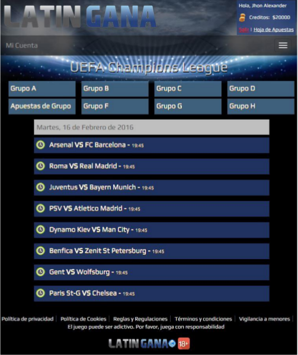
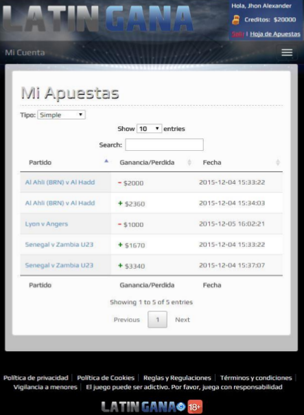
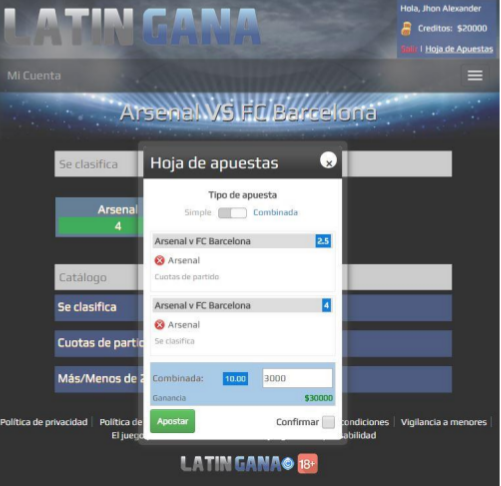
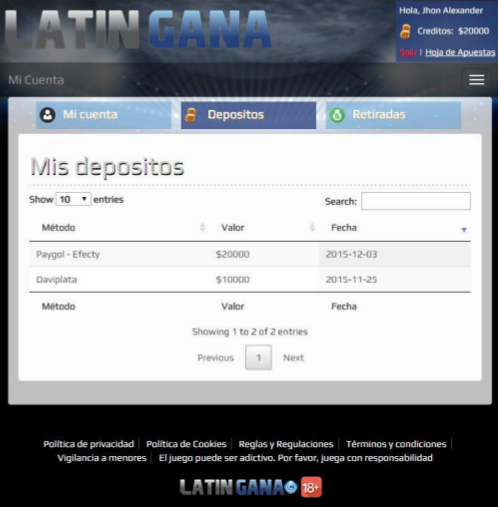

<h1>Sport Betting APP Betfair Market</h1>

I authorize any developer, person or company for using this application. But you must accomplish your country law and Betfair requirements to publish it.

Web based app for sports betting using <a href="https://github.com/danieledangeli/betfair-php">danieledangeli Betfair API wrapper repository</a> 
<b>Framework: </b>Codeigniter with PHP
 
It is in spanish but it is easy to translate. Just create milestone and we will get in touch with you. If you want new features feel free to develop it or create a request here in github.
 
Read <a href="https://github.com/rockscripts/Sport-Betting-APP-Betfair-Market/blob/master/Aplicacion%20para%20apuestas%20deportivas%20con%20cuotas%20de%20mercado.pdf">Theoric project</a> if you want know application details.

<h3>SCREENSHOTS</h3>

Full screenshots are in <a href="https://github.com/rockscripts/Sport-Betting-APP-Betfair-Market/blob/master/Aplicacion%20para%20apuestas%20deportivas%20con%20cuotas%20de%20mercado.pdf">Theoric project</a> . Go to page number 71

<table>
<tr>
<td>
    

        <h4>Events</h4>
        
    

</td>
<td>
   

        <h4>Betting History</h4>
        
    

</td>
</tr>
<tr>
<td>
     

        <h4>Betting Layer</h4>
        
    

</td>
<td>
    

        <h4>Financial</h4>
        
    

</td>
</tr>
</table>

 
*******************************************************************
<h1>IS MY COUNTRY AVAILABLE?</h1>

Kindly, check if your country is available for getting sports markets visiting <a href="https://www.betfair.com/">this website on Betfair</a>
 
<b style="color:red">If you are not able to load web page. It means you require an European or North America Account created on Betfair with VPN and install this application in EU or NA datacenter with Amazon AWS or Google Firebase service.</b> 

<h1>GETTING API KEYS</h1>

            
<h2>A&nbsp;<a href="http://register.betfair.com" target="_blank">Sign up</a> for a Betfair account<strong style="font-size: 1.5em;">&nbsp;</strong></h2>

<strong>Please note:&nbsp;</strong> Your Betfair account must be sufficiently funded &amp;&nbsp;<strong><a href="https://en-betfair.custhelp.com/app/answers/detail/a_id/72">verified</a>&nbsp;</strong>before your application for a Live Application Key will be considered. &nbsp;We do not accept Personal licence applications from&nbsp;<strong>India, Pakistan, Bangladesh, Sri Lanka or UAE</strong>.

&nbsp;

<h2>B Create a development App Key</h2>

 When you create your Application Key, a set of two keys is returned. One 'delay' key that is used for development and testing and one live key which is returned but inactive. &nbsp;Please click <a href="http://docs.developer.betfair.com/docs/display/1smk3cen4v3lu3yomq5qye0ni/Application+Keys" target="_blank">here</a>&nbsp;for more information about Delayed and Live Application keys.

<strong>What is an Application Key?</strong>

In order to use the Betfair API, you need an Application Key. You must pass the Application Key with every HTTP request. You do this by setting the HTTP header called&nbsp;<strong>X-Application</strong> with the value of the assigned key.

<strong>We recommend using a Google Chrome or Mozilla Firefox browser to complete the following process.</strong>

<ol><ol></ol></ol><ol class="black-number-box"><li> Login into your Betfair account via&nbsp;<strong><a href="https://www.betfair.com" target="_blank">www.betfair.com</a></strong></li>
<li>&nbsp;Using a <strong>separate browser window</strong>, click on the<strong>&nbsp;</strong><strong><a href="/exchange-api/accounts-api-demo/" target="_blank">Accounts API Demo Tool</a></strong> link.</li>
<li> Select the&nbsp;<strong>createDeveloperAppKeys</strong>&nbsp;operation from the list of Operations on the top left hand side of the Demo Tool. Your&nbsp;<strong>sessionToken </strong>will be automatically added to the&nbsp;<strong>'Session Token (ssoid)'</strong> text box.&nbsp;<strong>PLEASE NOTE: </strong>For the .au, .it, .es and .ro&nbsp;jurisdictions please check the Exchange API FAQ's (<a id="question-italian-exchange-how-do-i-retrieve-a-session-token-for-use-with-the-demo-tool" href="exchange-api/faq/SearchForm?Search=How+do+I+retrieve+a+session+token+for+use+with+the+Demo+Tool%3F&amp;action_results=Go#answer-italian-exchange-how-do-i-retrieve-a-session-token-for-use-with-the-demo-tool" data-target="answer-italian-exchange-how-do-i-retrieve-a-session-token-for-use-with-the-demo-tool" data-id="286" data-clickurl="" data-url="italian-exchange-how-do-i-retrieve-a-session-token-for-use-with-the-demo-tool" data-clicksno="22">How do I retrieve a session token for use with the Demo Tool?</a>)</li>
<li> Enter your&nbsp;<strong>Application Name</strong>&nbsp;(<strong>this must be unique</strong>) in the <strong>'Request</strong>' column.</li>
<li> Press&nbsp;<strong>Execute</strong>&nbsp;at the bottom of the<strong> 'Request'</strong> column. &nbsp;<strong>PLEASE NOTE:</strong> &nbsp;if you receive an error&nbsp;APP_KEY_CREATION_FAILED please check that you haven't created an App Key previously using th <strong>getDeveloperAppKeys</strong> request. &nbsp;</li>
<li> Your <strong>Application Key</strong> will be returned in the right hand side panel of the Demo Tool under the <strong>Application Key</strong> column. &nbsp;<strong>Please note:</strong>&nbsp; You may need to expand the <strong>Application Key</strong> column to see the full <strong>Application Key</strong> value which is 16 characters in total. &nbsp;The assigned <strong>Application Key</strong> can be retrieved at anytime using the <strong>getDeveloperAppKeys</strong> request.&nbsp;</li>
<li>The <strong>Application Key</strong> returned provides access to betting operations and delayed odds data - to be used for development and testing. Please apply for a live Application Key using the application form below once you have completed your development.</li>
</ol>

<h1>INSTALLING APPLICATION</h1>

    This application is web based with codeigniter framework and you must have a web server installed in your Operating System like XAMPP or Lampp or a live server hired with some hosting company. It does not requires any special configuration in server.

    <ol>
        <li>
          Use a domain for this application. If you are localhost then create a Virtual Host something like <b>latingana.com</b>. Kindly, query on Google "create virtual host for web server(XAMPP; LAMPP)" replace webserver for yours.
        </li>
        <li>
          Under PHPMYADMIN create database and import database.sql located in root project.
        </li>
        <li>
          Upload project files to your server. If you are working in local and you have GIT installed, just use follow git command: 
          <b>git clone https://github.com/rockscripts/Sport-Betting-APP-Betfair-Market.git</b>
        </li>
        <li>
           Configure database connection, set database name, user, password and host /application/config/database.php
        </li>
        <li>
           Configure Exchange API, set your appKey, username and password  /application/helpers/general_helper.php
        </li>
    </ol>

<b>Congratulations! Listen application typing your domain in your prefered web browser address bar.</b>

<h1>UPDATING COMPETITORS, EVENTS, MARKET CATALOG, USERS BETTING RESULTS, PROFIT, LOSSES AND ILEGAL ACTIVITIES</h1>

Create cronjobs and use <b>/application/controllers/Jobs.php</b> functions.

